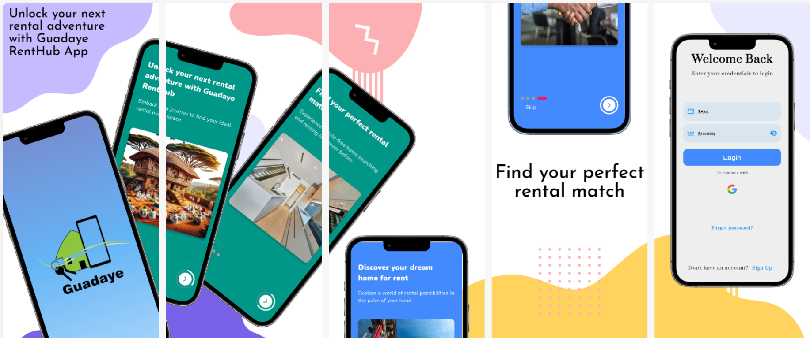
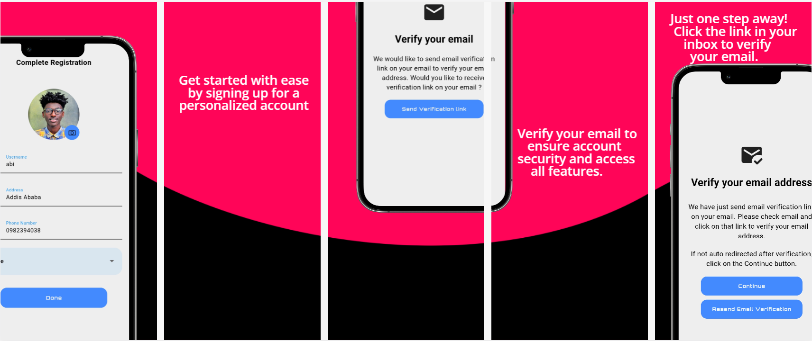
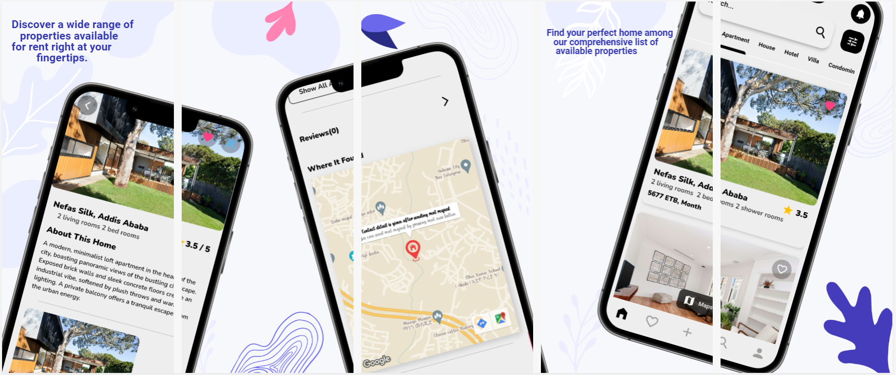
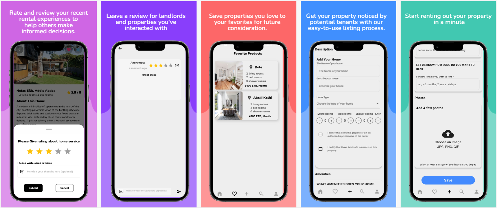
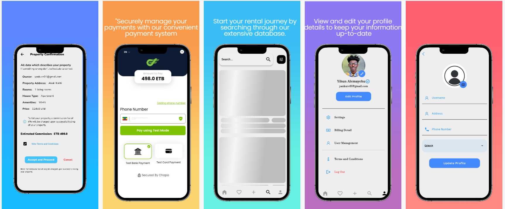
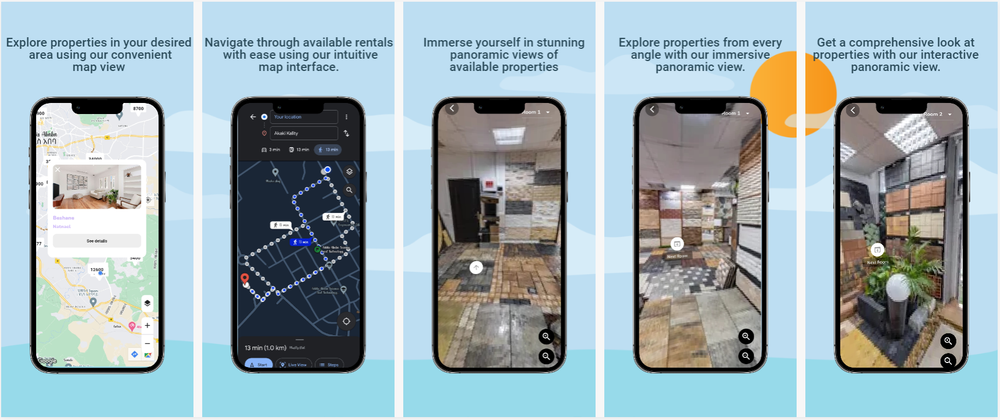
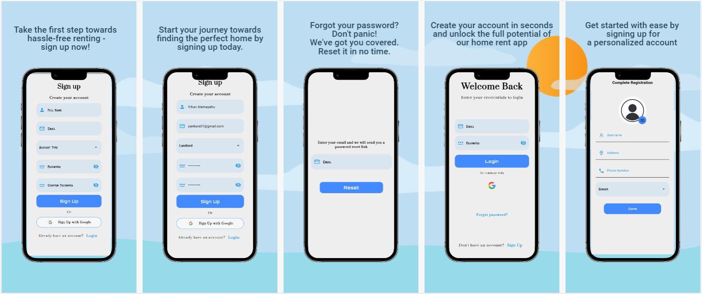
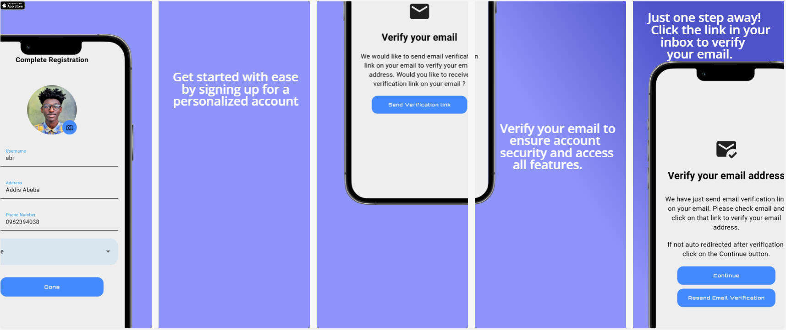

# Guadaye-RentHub : Home rent mobile app


## Table of Contents
- [About the Project](#about-the-project)
  - [Features](#features)
  - [Built With](#built-with)
- [Getting Started](#getting-started)
  - [Prerequisites](#prerequisites)
  - [Installation](#installation)
- [Usage](#usage)
- [Screenshots](#screenshots)
- [Roadmap](#roadmap)
- [Contributing](#contributing)
- [License](#license)
- [Contact](#contact)
- [Acknowledgements](#acknowledgements)

## About the Project

The Guadaye Home Rent mobile app is designed to provide a seamless and efficient way for users to find and rent homes. Whether you're looking for a short-term rental or a long-term home, Guadaye makes the process simple and convenient.

### Features
- **Browse Listings**: Explore a wide range of rental properties.
- **Advanced Search**: Use filters to find the perfect home based on location, price, amenities, and more.
- **User Profiles**: Create and manage profiles with saved searches and favorite listings.
- **Booking and Payments**: Securely book and pay for rentals directly through the app.
- **Landlord Communication**: Contact landlords easily for inquiries or scheduling viewings.
- **Reviews and Ratings**: Read reviews from previous tenants and rate your rental experience.
- **Virtual Tours**: View the property with emersive 360 panoramic view.

### Built With
- [Flutter](https://flutter.dev/) - Cross-platform mobile framework
- [Firebase](https://firebase.google.com/) - Backend services including authentication and real-time database
- [Google Cloud Platform](https://cloud.google.com/) - Cloud hosting and storage
- [Dart](https://dart.dev/) - Programming language

## Getting Started

To get a local copy up and running follow these simple steps.

### Prerequisites

Ensure you have the following installed:
- Flutter SDK: [Installation Guide](https://flutter.dev/docs/get-started/install)
- Dart: Included with Flutter SDK
- Firebase CLI: [Installation Guide](https://firebase.google.com/docs/cli)

### Installation

1. Clone the repo
```sh
git clone https://github.com/Yihun-Alemayehu/guadaye-home-rent.git
```
2. Navigate to the project directory
```sh
cd guadaye-home-rent
```
3. Install Flutter packages
```sh
flutter pub get
```
4. Set up Firebase for the project (iOS and Android)
   - Follow the instructions in the [Firebase documentation](https://firebase.google.com/docs/flutter/setup).

5. Run the app
```sh
flutter run
```

## Usage

Once the app is up and running, you can explore its features:
- **Sign Up/Login**: Create a new account or log in with existing credentials.
- **Browse Listings**: Explore properties by location or use the search feature.
- **Contact Landlords**: Send messages to landlords to schedule viewings or ask questions.
- **Book Rentals**: Securely book and pay for your rental through the app.
- **Manage Profile**: Update your profile information and view your rental history.

## Screenshots

<p align="center">
  
  
  
  
  
  
  
  
  
</p>

## Roadmap

We are continuously working to improve the app and add new features. Here's what's coming next:
- [ ] Enhanced Search Filters
- [ ] Tenant Insurance Options
- [ ] Multi-language Support
- [ ] Push Notifications for New Listings

See the [open issues](https://github.com/yourusername/guadaye-home-rent/issues) for a full list of proposed features and known issues.

## Contributing

We welcome contributions to enhance the app! Here's how you can get involved:
1. Fork the Project
2. Create your Feature Branch (`git checkout -b feature/AmazingFeature`)
3. Commit your Changes (`git commit -m 'Add some AmazingFeature'`)
4. Push to the Branch (`git push origin feature/AmazingFeature`)
5. Open a Pull Request

## License

Distributed under the MIT License. See `LICENSE.txt` for more information.

## Contact

Yihun Alemayehu - yankure01@gmail.com


## Acknowledgements

- [Flutter](https://flutter.dev/)
- [Firebase](https://firebase.google.com/)
- [Google Cloud Platform](https://cloud.google.com/)
```
